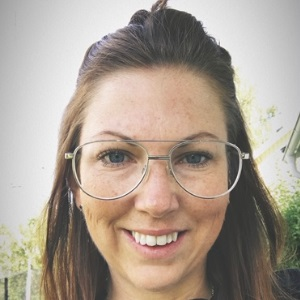

<iframe height="200px" width="100%" frameborder="no" scrolling="no" seamless="" src="https://player.simplecast.com/15cde978-26e1-4266-b3a2-2996401830d7?dark=false"></iframe>

I detta avsnitt träffar vi Erica Karlsson, agil coach på SPP, och pratar om hur man kan skala upp det agila arbetet till att omfatta en hel organisation. Kan man verkligen driva ett helt företag i sprintar? Vad är ett inkrement? Går det verkligen att ha en sprintplanering tillsammans med hundratals människor? Svaret på detta och mycket mer i veckans avsnitt!

## Veckans gäst
Veckans gäst är Erica Karlsson, agil coach på SPP. Så här berättar Erica om sig själv: _"Jag heter Erica Karlsson och arbetar som agil coach. I rollen får jag hjälpa mina kollegor att varje dag bli lite bättre. Det är fantastiskt roligt. Jag har de senaste åren arbetat med agila team i organisationer som vill skala upp det agila arbetssättet från team till hela organisationen. Det finns mycket att utforska, jag har bara skrapat på ytan."_

## Shownotes
* [Scaled Agile Framework (SAFe)](https://www.scaledagileframework.com/)
* [Essential SAFe](https://www.scaledagileframework.com/essential-safe/)
* [Big Room Planning](https://www.infoq.com/articles/making-scaling-agile-work-4)
* [Large Scale Agile (LeSS)](https://www.scaledagileframework.com/)

