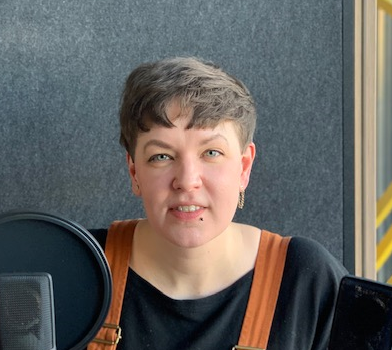

<iframe height="200px" width="100%" frameborder="no" scrolling="no" seamless="" src="https://player.simplecast.com/c2ac112f-fbb9-4b42-a2a2-acf98cebb4a3?dark=false"></iframe>

Denna vecka träffar vi Ida Franceen som brinner för tillgänglighet, på engelska accessibility. Till skillnad från vad många tror handlar det inte om ett sista steg som ska läggas på innan projektet skeppas utan det ska finnas med från börjar – det underlättar och förbättrar för alla användare! Vi går igenom några handfasta tips på hur man kan få sina egna projekt att bli tillgängliga för fler användare, om meetups och mastodontrapporter som aldrig blir lästa.

Lyssna på [Spotify](https://open.spotify.com/episode/7lwowMFWv4DV7TzkqMyOhM) | [iTunes](https://podcasts.apple.com/se/podcast/006-tillg%C3%A4nlighet-f%C3%B6r-alla-med-ida-franceen/id1455198510?i=1000434557015&l=en) | [Overcast](https://overcast.fm/+RBmlTt8R4)

## Veckans gäst
_Ida är en utvecklare med en hel del erfarenhet av att bygga saker. Framför allt på webben. Hon gillar att vara en del av olika event både som deltagare, talare och organisatör. För ett antal år sedan var hon med och startade [t12t](https://www.meetup.com/t12t-Stockholm/), ett initiativ för att öka kunskapen runt digital tillgänglighet. 2016 organiserade hon CSSconf i Oslo, en konferens med fokus på design och utveckling._

_Just nu är hon på jakt efter ett nytt jobb samtidigt som hon jobbar med planeringen av nästa t12t event. Ni hittar henne på [@kolombiken](https://twitter.com/kolombiken)._

## Länkar
* [Uncanny a11y](http://adrianroselli.com/2019/02/uncanny-a11y.html)
* [t12t nyhetsbrev](https://t12t.se/accessibility-newsletter/)
* [Funkify](https://www.funkify.org/simulators)
* [NVDA](https://www.nvaccess.org/download/)

## Citerbara citat
> ”Alla måste vara med på tåget för att det ska funka”

> ”Då kom de med en mastodontrapport på 25 sidor som det inte fanns någon budget kvar att implementera”

> ”Det jag rekommenderar är att bara lyssna igenom [skärmen] med en skärmläsare – fastnar den t.ex. i en loop?”

> ”Ett lätt tips – kisa med ögonen. Känns det logiskt? Kan man urskilja funktionaliteten?”

> ”Man kanske tror att det är ett smalt område, men egentligen är det hur brett som helst.”

> ”Vem du än är – gå på meetupen!”

