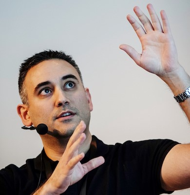
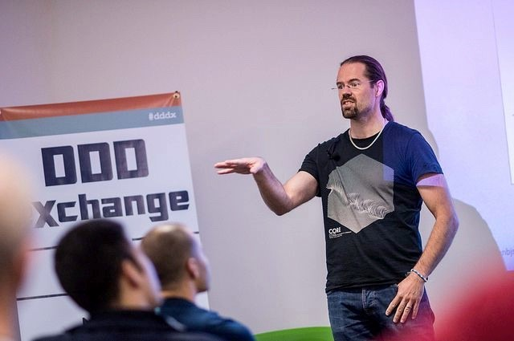

<iframe height="200px" width="100%" frameborder="no" scrolling="no" seamless src="https://player.simplecast.com/b44de404-80d0-401d-90be-bead22224154?dark=false"></iframe>

Lyssna på [Spotify](https://open.spotify.com/episode/48j9KoojFbCCQlm6nIwT9t) | [iTunes](https://podcasts.apple.com/se/podcast/017-secure-by-design-med-daniel-deogun-och-dan-bergh/id1455198510?i=1000453672345&l=en) | [Overcast](https://overcast.fm/+RBmmJQpxA)

Att släppa en riktig, fysisk bok ligger nog på många utvecklares önskelista. Några som har gjort slag i saken är veckans gäster - Daniel Deogun och Dan Bergh Johnsson från Omegapoint. De har precis gett ut en bok på Manning Publications - Secure By Design - där avhandlar hur man gör säkerhet till en naturlig del av designen. I veckans avsnitt pratar Bartek med Dan och Daniel och får lära sig vad CIA Triad är, att säkerhet är en business enabler och att man inte ska lagra personnummer som en sträng.

## Veckans gäst
_Daniel och Dan, som jobbar som konsulter på Omegapoint, är luttrade programmerare och arkitekter som ofta syns prata på konferenser om högkvalitativ systemutveckling i allmänhet och säkerhet i synnerhet._

_Tillsammans med Daniel Sawano har de nyligen släppt boken “Secure by Design” om hur man genom klokt vald design kan öka säkerheten dramatiskt, utan att behöva tänka aktivt på säkerhet hela tiden. Boken har mötts med nyfiket intresse och ligger just nu trea på förlagets bästsäljarlista._

## Länkar

## Länkar

* Daniels twitter: [@DanielDeogun](https://twitter.com/DanielDeogun)
* Dans twitter: [@danbjson](https://twitter.com/danbjson)
* [Secure by design hos förläggaren](https://www.manning.com/books/secure-by-design)
* [Domain Primitives in Action](https://www.youtube.com/watch?v=ogjOKlXHi08)
* [OWASP top 10 – lista över mest kritiska sårbarheter i webbapplikationer](https://www.owasp.org/index.php/Category:OWASP_Top_Ten_Project)
