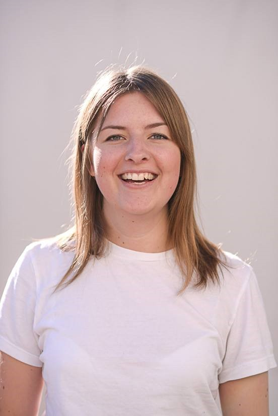

<iframe height="200px" width="100%" frameborder="no" scrolling="no" seamless src="https://player.simplecast.com/544f53b1-056f-4bce-8091-c7c8f8c22a26?dark=false"></iframe>

Lyssna på [Spotify](https://open.spotify.com/show/3yUXDikALYz3dDYhmKaXRs) | [iTunes](https://podcasts.apple.com/se/podcast/kompilator/id1455198510) | [Overcast](https://overcast.fm/itunes1455198510/kompilator)

Barteks aldrig sinande törst efter utveckling som inte handlar om webb får sitt lystmäte när han i detta avsnitt får prata med Sanna Marklund om robotutveckling. Sanna utvecklar sociala robotar på företaget Prototyp, och då särskillt på plattformen Furhat. Vi dyker ner i detaljerna om hur man designar, bygger och testar robotar, och får bland annat reda på att  att robotar passar utmärkt i HR-sammanhang då de helt saknar fördomar.

## Veckans gäst

_Kod var aldrig den självklara vägen för Sanna utan ett intresse som sakta fått växa fram från tonåren fram tills när hon skulle börja sitt första jobb efter sin utbildning. Hon har hunnit med två år som utvecklare på Bonnier innan hon bytte bana och började programmera sociala robotar, bland annat rekryteringsroboten Tengai._

## Länkar

* [Roboten Furhat](https://furhat.io)
* [Furhat Robotics Sample Skills](https://github.com/FurhatRobotics/example-skills)
* [Uncanny Valley](https://en.wikipedia.org/wiki/Uncanny_valley)
* [Google Home Actions](https://console.actions.google.com)