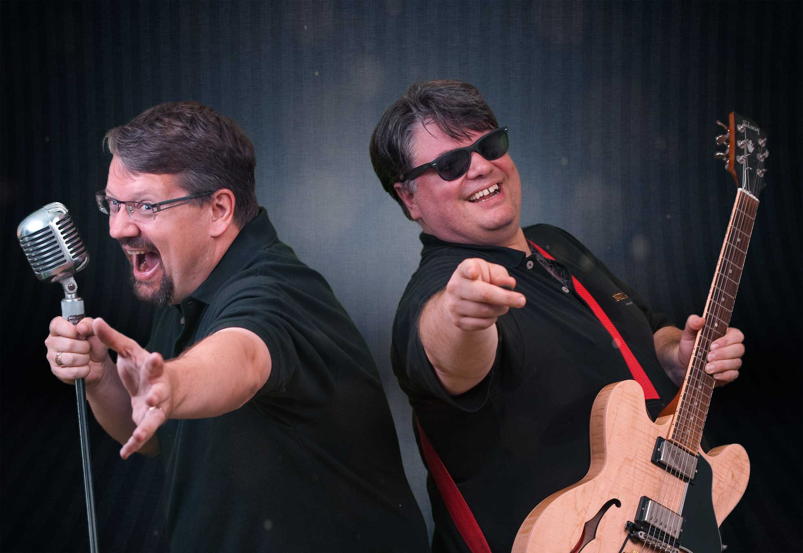

<iframe height="200px" width="100%" frameborder="no" scrolling="no" seamless src="https://player.simplecast.com/d7b646de-8fc5-40da-b414-2f2fc2e5a71d?dark=false"></iframe>

.Net Rocks is probably the worlds longest running podcast - it started before the first iPod was released! This week Bartek sits down with Carl Franklin and Richard Campbell, the two hosts of .Net Rocks and chats about topics like the history of .Net, podcasting in the early 2000's, who killed Silverlight and of course - what if .Net doesn't rock? (Spoiler: it totally does).

## Veckans gäst
**Carl Franklin** - _Carl Franklin is Executive Vice President of App vNext, a software development firm focused on the latest methodologies and technologies. Carl is a 20+ year veteran of the software industry, co-host and founder of .NET Rocks!, the first and most widely listened to podcast for .NET developers, a Microsoft MVP for Kinect for Windows, a Microsoft Regional Director, and Senior Executive of Pwop Studios, a full-service audio and video production/post production studio located in Southeastern Connecticut._

**Richard Campbell** - _Richard Campbell started playing with microcomputers in 1977 at the age of 10. He's really never done anything else since. In that time he's been involved in every level of the PC industry, from manufacturing, to sales, to development, and into large scale infrastructure implementation. He has been a witness and participant to the Bill Gates vision of "A PC on every desktop."_

## Titlar och länkar
- (00:20) Bartek tells a story about his run-in with Iron Maiden
- (02:02) Who are your work idols?
- (05:45) Longest running _anything_
- (06:19) What if .Net doesn't rock?
- (07:20) [http://www.thetabletshow.com/](The Tablet Show)
- (09:30) Bartek looks forward to maturity
- (13:00) Carl and Richard discuss what killed Silverlight
- (15:53) Everyone loves Blazor
- (16:50) Why is nuget more stable than npm?
- (20:14) .Net Rocks - on CD
- (31:32) Teams at Microsoft reguraly come on .Net Rocks to announce new products
- (33:20) Some products got cancelled before the show was aired
- (37:39) Richard is writing a book about The History of .Net
- (40:46) .Net Rocks opens up doors
- (42:30) There will be bombshells
- (44:43) Open Source was not popular at Microsoft
- (46:03) What really happened with Silverlight and Win8? Richard knows!
- (46:52) Bill Gates is still 20% at Microsoft
- (48:00) Ballmer might show up
- (49:02) How do you NOT choose javascript?
- (50:42) Where is .Net going in the future?
- (52:20) .Net on the server makes sense

## Gilla och följ Kompilator

Om du gillade detta avsnitt kan du prenumerera på Kompilator i din poddapp. Jag blir jätteglad om du [lämnar ett omdöme på iTunes](https://podcasts.apple.com/se/podcast/kompilator/id1455198510?mt=2) vilket hjälper fler att upptäcka podden.

Kompilator hittas på [världsvida webben](https://kompilator.se) men även på [@kompilatorpod](https://twitter.com/kompilatorpod)  på Twitter och [LinkedIn](https://www.linkedin.com/company/kompilator).